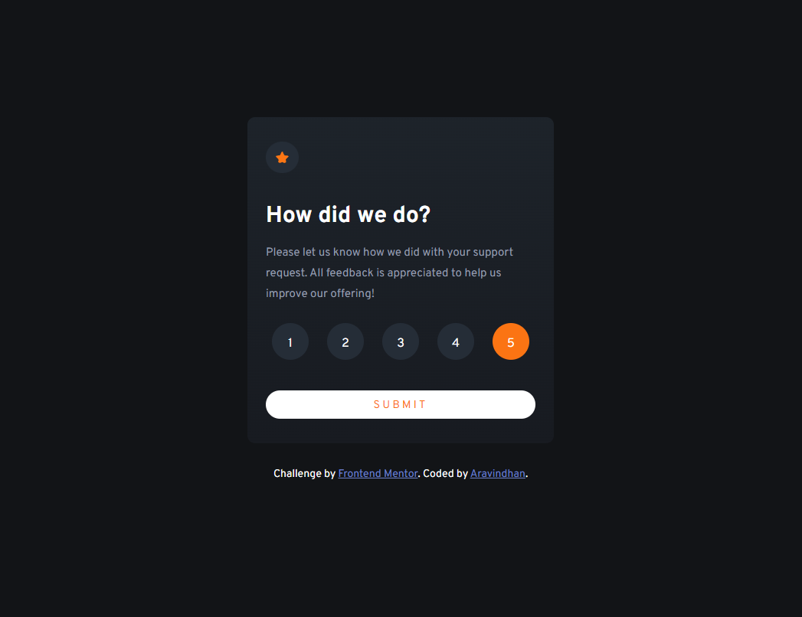
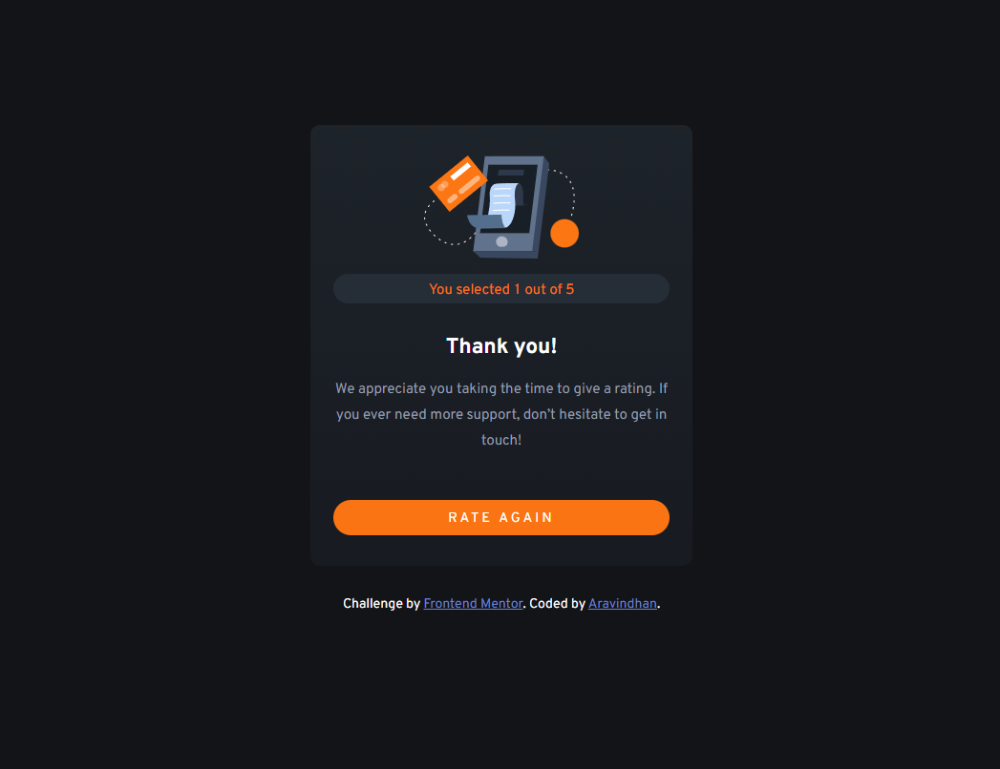

# Frontend Mentor - Interactive rating component solution

This is a solution to the [Interactive rating component solution challenge on Frontend Mentor]

# Table of contents

  - [Screenshot]
  - [Links]
  - [Author]

### Screenshot

### Links

- Solution URL: [https://github.com/aravindhan7/Interactive-rating-component]
- Live Site URL: [https://aravindhan7.github.io/product-preview/]

## Author

- Website - [https://aravindhan-portfolio-website.netlify.app/]
- Frontend Mentor - [https://www.frontendmentor.io/profile/aravindhan7]
